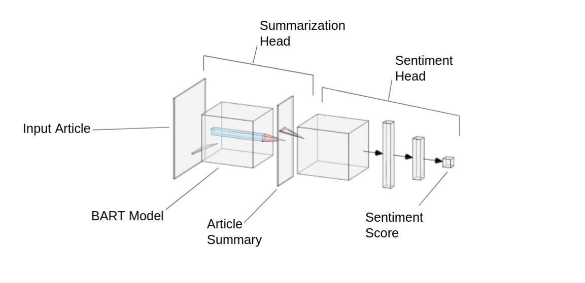

# Sentiment Aware Summary Generation

## Problem Statement
In today’s fast-paced world, we strive to consume as much information as possible without regard to the emotional content it carries. We try to save time using text summarization on various informational content such as news sources, articles, Twitter posts, and Reddit posts. However, this summarized content may not be sentimentally consistent with the source text. This mismatch in sentiment can lead to information not being communicated in the most effective way possible and may also not have the same emotional impact as the original article.  

## Dataset
We will be using the CNN/Daily Mail dataset to create a text summarization task model. This dataset consists of News Articles and their Summaries. It has 287,113 articles in the training set, 13,368 in the validation, and 11,490 in the testing set. 
Link
We will manually generate the text classification dataset for sentiment analysis from the CNN/Daily Mail dataset.

## Proposed Solution
We will be working with various state of the art language models such as BERT, BART, XLNet, and RoBerta to propose a summary and a Sentiment score for the article. We plan on introducing a Sentiment Consistency Loss, which will ensure that the summary and article have the same sentimental impact. We will evaluate the generated summary using ROGUE and the percentage difference in sentiment scores of the Original article and generated summary.

## Model Architecture

 

### For additional information on implementation details and experiments please [review project report](PDF/Sentiment_summarization.pdf)

## Metrics

|          Model |    BLEU |    MASD |   Loss |
|---------------:|--------:|--------:|-------:|
| Baseline model | 0.15472 | 1.65803 | 1.5689 |
|   Weighted MSE | 0.16021 | 0.04265 | 3.0405 |
|   Balanced MSE | 0.16022 | 0.21982 | 1.7832 |
|    Weighted KL | 0.17555 | 0.03472 | 0.9781 |

## Example Output

### MSE equal weights generated captions (Article has been truncated)

| Article                                                                                                                                                                                                                                                                                                                                                                                                                                                                                                                                                                                                                                                                                                                                                                                                                                                                                                                                                                | Ground truth                                                                                                                                                                                                                               | Predicted                                                                                                                                                                                                                                                                                                 |   |   |
|------------------------------------------------------------------------------------------------------------------------------------------------------------------------------------------------------------------------------------------------------------------------------------------------------------------------------------------------------------------------------------------------------------------------------------------------------------------------------------------------------------------------------------------------------------------------------------------------------------------------------------------------------------------------------------------------------------------------------------------------------------------------------------------------------------------------------------------------------------------------------------------------------------------------------------------------------------------------|--------------------------------------------------------------------------------------------------------------------------------------------------------------------------------------------------------------------------------------------|-----------------------------------------------------------------------------------------------------------------------------------------------------------------------------------------------------------------------------------------------------------------------------------------------------------|---|---|
| (CNN)The world learned his name after he was killed by a South Carolina police officer. But in his life, 50-year-old Walter Scott was also the father of four children and served in the Coast Guard before being honorably discharged. "He was outgoing -- loved everybody, (was) very known in the community and got along with everybody," his brother Anthony Scott told CNN\'s Don Lemon. "All the family loves him, and his kids loved him." .... Slager has been charged with murder, a charge that might not have come about if not for a bystander\'s video of the shooting. Anthony Scott said he watched the video                                                                                                                                                                                                                                                                                                                                          | Walter Scott owed over $18,000 in back child support payments, documents show.\nWalter Scott had four children and served in the Coast Guard, his brother says.\nHe was shot in the back and killed by a North Charleston police officer.' | Walter Scott, over $18,000 in back payments support.. according show.\nHeter Scott was been children and served in the Coast Guard before according brother Anthony.\nHe was also and the head and killed by North North Charleston police officer.                                                       |   |   |
| (CNN)President Barack Obama took part in a roundtable discussion this week on climate change, refocusing on the issue from a public health vantage point. After the event at Washington\'s Howard University on Tuesday, Obama sat down with me for a one-on-one interview. I asked him about the science behind climate change and public health and the message he wants the average American to take away, as well as how enforceable his action plan is. Here are five things I learned...When asked what the average American can do about all this, the President'                                                                                                                                                                                                                                                                                                                                                                                               | "No challenge poses more of a public threat than climate change," the President says.\nHe credits the Clean Air Act with making Americans "a lot" healthier.'                                                                              | PresidentNo challenge poses more of a public threat than climate change," the President told.\nHe says the Clean Air Act and making Americans healthiera lot" healthier.                                                                                                                                  |   |   |
|                                                                                                                                                                                                                                                                                                                                                                                                                                                                              Failure Case                                                                                                                                                                                                                                                                                                                                                                                                                                                                              |                                                                                                                                                                                                                                            |                                                                                                                                                                                                                                                                                                           |   |   |
| Paris (CNN)Six survivors of the Paris kosher supermarket siege in January are suing a French media outlet for what they call dangerous live broadcasting during the hostage-taking. According to Paris prosecutor\'s spokeswoman Agnes Thibault-Lecuivre, the lawsuit was filed March 27 and a preliminary investigation was opened by the prosecutor\'s office Wednesday. The media outlet, CNN affiliate BFMTV, is accused of endangering the lives of the hostages, who were hiding in a cold room during the attack, by broadcasting their location live during the siege. ... The two brothers blamed for that attack, Cherif and Said Kouachi, were killed on January 9 after a violent standoff at an industrial site. The terror attacks claimed the lives of 17 people and put France on a heightened state of alert. CNN\'s Ariana Williams reported from Paris, and Laura Smith-Spark wrote from London. CNN\'s Pierre Meilhan contributed to this report.' | Six people taken hostage in a kosher market siege say media outlet endangered their lives.\nThey hid in a cold room during the attack in Paris by gunman Amedy Coulibaly.'                                                                 | "Six survivors were hostage in Paris Paris supermarket in in they outlet'their lives.\nThe are in cold cold room during the siege. January. broadcasting Amedy Coulibaly.\nThe gunman gunman the the gunman the,, theThe gunman the the,, the gunman the the the the the the the the the the of the the-" |   |   |

### Weighted MSE generated captions (Article has been truncated)

| Article                                                                                                                                                                                                                                                                                                                                                                                                                                                                                                                                                                                                                                                                                                                                                                                                                                                                                   | Ground truth                                                                                                                                                                                                                                                       | Predicted                                                                                                                                                                                                                                                                        |
|-------------------------------------------------------------------------------------------------------------------------------------------------------------------------------------------------------------------------------------------------------------------------------------------------------------------------------------------------------------------------------------------------------------------------------------------------------------------------------------------------------------------------------------------------------------------------------------------------------------------------------------------------------------------------------------------------------------------------------------------------------------------------------------------------------------------------------------------------------------------------------------------|--------------------------------------------------------------------------------------------------------------------------------------------------------------------------------------------------------------------------------------------------------------------|----------------------------------------------------------------------------------------------------------------------------------------------------------------------------------------------------------------------------------------------------------------------------------|
| "Sanaa, Yemen (CNN)Al Qaeda fighters attacked a prison in the coastal Yemeni city of Al Mukallah early Thursday, freeing at least 270 prisoners, a third of whom have al Qaeda links, a senior Defense Ministry official has told CNN. ... And while the conflict between the Houthis and forces loyal to Hadi rages in the western part of the country, where it has caused hundreds of civilian deaths, al Qaeda in the Arabian Peninsula, or AQAP, controls parts of eastern Yemen. AQAP is considered one of the most ruthless branches of the terrorist organization."                                                                                                                                                                                                                                                                                                               | Al Qaeda fighters attack a prison and other government buildings, freeing many prisoners.\nGovernment troops clash with the fighters, most of whom flee.\nYemen is descending into chaos as a Shia-Sunni conflict draws in regional rivals Saudi Arabia and Iran.' | "Al Qaeda fighters attacked prison prison in seize government buildings in officials 270 prisoners.\nThe troops arrived with al militants, and of whom have,\nAlemen's descending into chaos after the sectarian Houthledni conflict r in regional rivals Saudi Arabia and Iran. |
| "(CNN)Syria is a Hell on Earth that is expanding in plain sight. The death toll there has doubled in a year's time, if an opposition group is right. Since civil war broke out there, 310,000 people have been killed, the Syrian Observatory for Human Rights said Thursday. Violence has plunged well over half of all Syrians into such destitution that they are in dire need of survival aid, the United Nations says, as food rations are being cut for lack of donations. Numbers alone can't convey the immeasurable anguish of millions, but maybe it can remind the rest of us of the magnitude of the world's currently greatest tragedy...That means people receiving aid will get only 60% of the daily nutrition they need."                                                                                                                                                | More people have been displaced than live in Moscow; more people lost their homes than live in greater Boston.\nThe WFP has cut food ration sizes by 30% for lack of donations.'                                                                                   | Syria than have been killed from ever in Syria, U than are their lives. killed in Moscow Moscow.\nThe UFP says cut food ring for 60% since lack of donations.                                                                                                                    |
|                                                                                                                                                                                                                                                                                                                                                                                                                                        Failure Case                                                                                                                                                                                                                                                                                                                                                                                                                                       |                                                                                                                                                                                                                                                                    |                                                                                                                                                                                                                                                                                  |
| (CNN)Most companies in South Korea have hoesik at least once a month and sometimes every week. Literally, this means dinner with co-workers. In practice, it means official eating/drinking fests involving multiple rounds of alcohol at multiple venues. For the foreign business traveler, using foreignness as an excuse to bow out of the action only goes so far. The pressure to participate is intense. Drinking etiquette is the first thing you teach foreign guests," says Bryan Do, a Korean-American director at the South Korean branch of a U.S. company. ...So how do you avoid offending someone (worst of all, a superior or client) at a Korean drinking extravaganza? Follow these seven handy rules. Koreans always identify the "higher" person in the relationship, and defer to them accordingly. One of the first things Koreans often ask when meeting someone' | Hoesik is the Korean tradition of eating and drinking together.\nAnthony Bourdain travels to Korea for the season five premiere of "Parts Unknown"'                                                                                                                | Koesik is a first equivalent of drinking and drinking..\nIt Leedain, to Seoul to work first. of of hisThe Unknown"............ the the the the the the the the the the American the the the the the the the the the the the theThe the the of the'                               |

### Weighted KL generated captions (Article has been truncated)

| Article                                                                                                                                                                                                                                                                                                                                                                                                                                                                                                                                                                                                                                                                                                                                                                                                                                                                                   | Ground truth                                                                                                                                                                                                                                                       | Predicted                                                                                                                                                                                                                                                                        |
|-------------------------------------------------------------------------------------------------------------------------------------------------------------------------------------------------------------------------------------------------------------------------------------------------------------------------------------------------------------------------------------------------------------------------------------------------------------------------------------------------------------------------------------------------------------------------------------------------------------------------------------------------------------------------------------------------------------------------------------------------------------------------------------------------------------------------------------------------------------------------------------------|--------------------------------------------------------------------------------------------------------------------------------------------------------------------------------------------------------------------------------------------------------------------|----------------------------------------------------------------------------------------------------------------------------------------------------------------------------------------------------------------------------------------------------------------------------------|
| "Sanaa, Yemen (CNN)Al Qaeda fighters attacked a prison in the coastal Yemeni city of Al Mukallah early Thursday, freeing at least 270 prisoners, a third of whom have al Qaeda links, a senior Defense Ministry official has told CNN. ... And while the conflict between the Houthis and forces loyal to Hadi rages in the western part of the country, where it has caused hundreds of civilian deaths, al Qaeda in the Arabian Peninsula, or AQAP, controls parts of eastern Yemen. AQAP is considered one of the most ruthless branches of the terrorist organization."                                                                                                                                                                                                                                                                                                               | Al Qaeda fighters attack a prison and other government buildings, freeing many prisoners.\nGovernment troops clash with the fighters, most of whom flee.\nYemen is descending into chaos as a Shia-Sunni conflict draws in regional rivals Saudi Arabia and Iran.' | "Al Qaeda fighters attacked prison prison in seize government buildings in officials 270 prisoners.\nThe troops arrived with al militants, and of whom have,\nAlemen's descending into chaos after the sectarian Houthledni conflict r in regional rivals Saudi Arabia and Iran. |
| "(CNN)Syria is a Hell on Earth that is expanding in plain sight. The death toll there has doubled in a year's time, if an opposition group is right. Since civil war broke out there, 310,000 people have been killed, the Syrian Observatory for Human Rights said Thursday. Violence has plunged well over half of all Syrians into such destitution that they are in dire need of survival aid, the United Nations says, as food rations are being cut for lack of donations. Numbers alone can't convey the immeasurable anguish of millions, but maybe it can remind the rest of us of the magnitude of the world's currently greatest tragedy...That means people receiving aid will get only 60% of the daily nutrition they need."                                                                                                                                                | More people have been displaced than live in Moscow; more people lost their homes than live in greater Boston.\nThe WFP has cut food ration sizes by 30% for lack of donations.'                                                                                   | Syria than have been killed from ever in Syria, U than are their lives. killed in Moscow Moscow.\nThe UFP says cut food ring for 60% since lack of donations.                                                                                                                    |
|                                                                                                                                                                                                                                                                                                                                                                                                                                        Failure Case                                                                                                                                                                                                                                                                                                                                                                                                                                       |                                                                                                                                                                                                                                                                    |                                                                                                                                                                                                                                                                                  |
| (CNN)Most companies in South Korea have hoesik at least once a month and sometimes every week. Literally, this means dinner with co-workers. In practice, it means official eating/drinking fests involving multiple rounds of alcohol at multiple venues. For the foreign business traveler, using foreignness as an excuse to bow out of the action only goes so far. The pressure to participate is intense. Drinking etiquette is the first thing you teach foreign guests," says Bryan Do, a Korean-American director at the South Korean branch of a U.S. company. ...So how do you avoid offending someone (worst of all, a superior or client) at a Korean drinking extravaganza? Follow these seven handy rules. Koreans always identify the "higher" person in the relationship, and defer to them accordingly. One of the first things Koreans often ask when meeting someone' | Hoesik is the Korean tradition of eating and drinking together.\nAnthony Bourdain travels to Korea for the season five premiere of "Parts Unknown"'                                                                                                                | Koesik is a first equivalent of drinking and drinking..\nIt Leedain, to Seoul to work first. of of hisThe Unknown"............ the the the the the the the the the the American the the the the the the the the the the the theThe the the of the'                               |